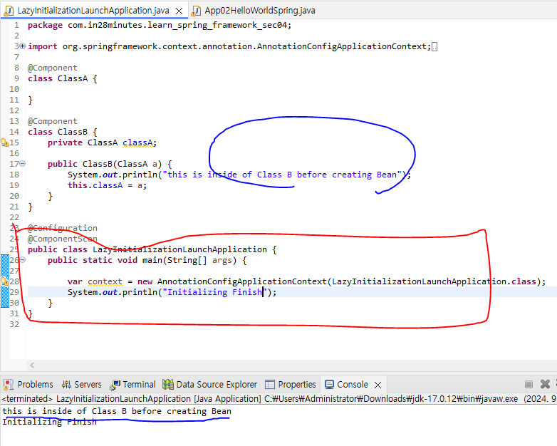
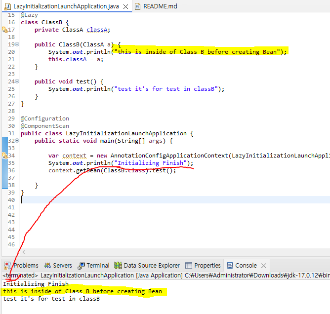

<h3>Lazy Loading </h3>

	생성하지 않았음에도
	Context만 생성되어서 @Component Bean들은 자동으로 초기화 생성된다.

	@Lazy 라는 어노테이션을 이용해
	Bean을 사용할 때만 불러오도록 한다

## Lazy를 선호? 바로 초기화를 선호?
## 바로 초기화 선호 -> 초기화 하면서 오류를 바로 확인할 수 있다

### 즉시초기화 vs Lazy

즉시초기화
	-장점: 빠르다, 오류를 빨리 찾을 수 있다.
	-단점: 메모리사용이 많을 수 있다.
	
Lazy
	-장점: 메모리를 절약할 수 있다. 
	-단점: 오류 추적이 쉽지 않다. 
	

### Singleton vs Prototype
<h2>Java Singleton은 JVM 위에서 객체 한개</h2>
<h2>Spring Singleton은 Spring Context 위에서 객체 한개</h2>

<h2>Prototype은 Http, Session 등의 객체를 생성할 때 사용한다</h2>

<h3>Singleton</h3>
<ul>
	<li>IOC에 단 하나!!</li>
	<li>기본적으로 Bean을 싱글톤</li>
	<li>싱글톤을 쓰면 같은 것을 항상 같이 쓴다</li>
</ul>

<h3>Prototype</h3>
<ul>
	<li>Session, Http 등 하나당 객체 하나를 사용한다. </li>
</ul>

