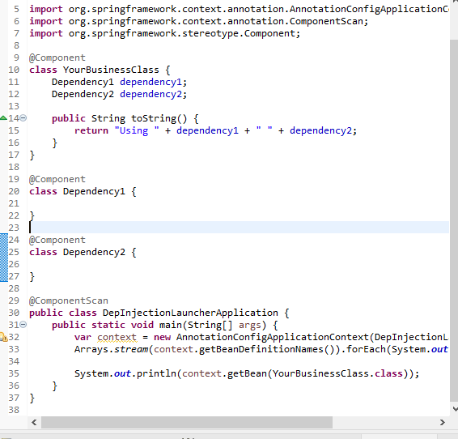
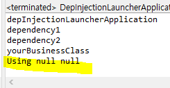
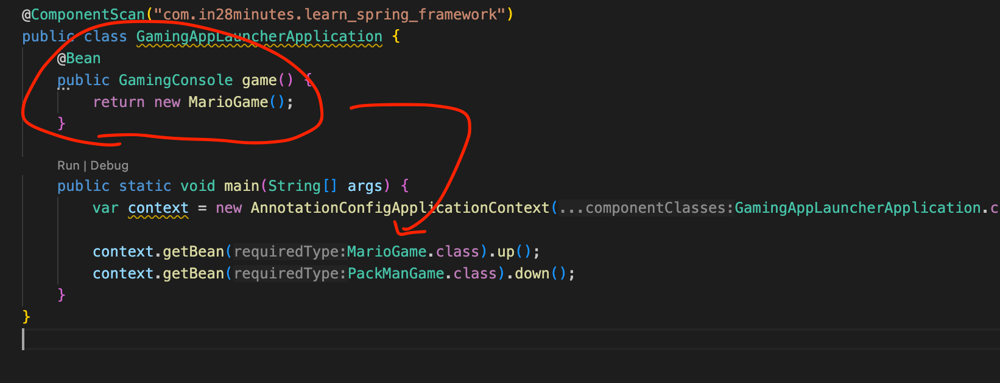
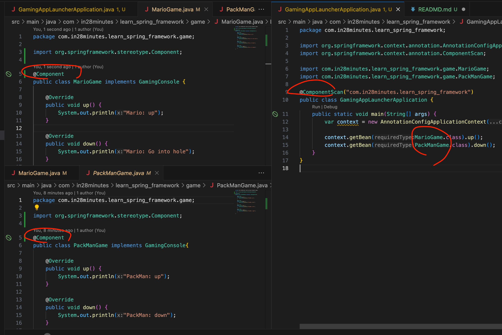
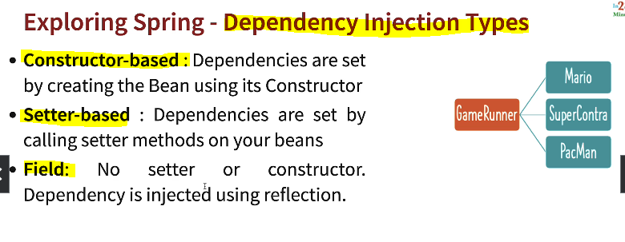
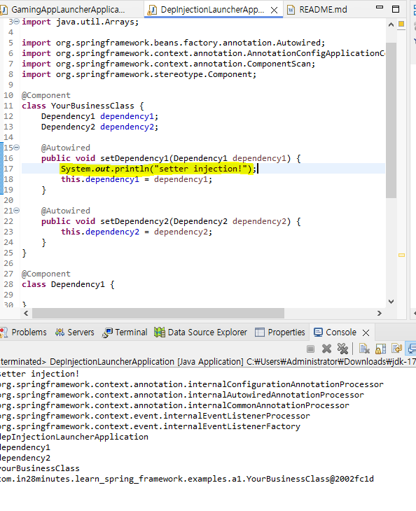
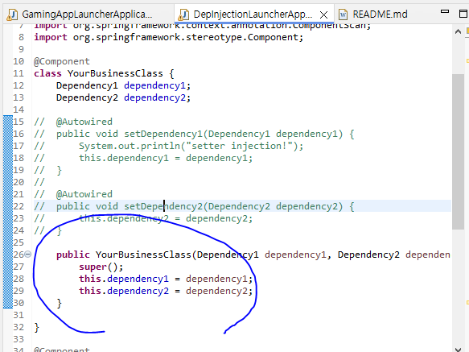

#### Summary
##### Bean을 만드는 방법
<ul>
	<li>1. @Bean을 이용해서 만들기</li>
	<li>2. @Component를 이용해서 로컬말고 다른 곳에 만들기</li>
</ul>

<h3>Field Injection 확인해보기</h3>
 
결과는  

*** dependency1, dependency2가 안나와 있다.

그 이유는 
IOC에서는 둥둥 떠다니지만 Autowired로 안꽃아 줬기 때문이다.

##### Spring Context에 실을 대상을 @Component로 알려줌
##### @ComponentScan 을 통해 SpringContext 넣을 대상들을 가져감 

##### SpringContext에 실을 때 @Component 사용 안하는 경우

    @Bean
    public GamingConsole game() {
        return new MarioGame();
    }

 

##### SpringContext에 실을 때 @Component 사용 하는 경우

#### @Primary @Qualifier 두개를 사용할 때 
##### GamingConsole 인터페이스를 구현한 A,B,C 가 있다고 할 때 
##### A,B,C 중 @Primary로 선언된 컴포넌트 먼저 확인 
##### 특정 컴포넌트를 사용하고 싶다면, 
##### 1. 특정 컴포넌트에 @Qualifier("이름") 을 정해준다.
##### 2. 사용하려는 곳에서 @Qualifier("이름")으로 가져와서 사용한다.

#### @Qualifier는 특정 이름 안지어도 클래스명(소문자)로 가져올 수 있음
#### @ComponentScan은 경로 지정하지 않으면 해당 패키지 안에서 가져옴

##### injection의 종류를 알아보자
<h1>injection - Field Injection을 알아보자</h1>
<h3>Field Injection 확인해보기</h3>
 
결과는  

*** dependency1, dependency2가 안나와 있다.

그 이유는 
IOC에서는 둥둥 떠다니지만 Autowired로 안꽃아 줬기 때문이다.

<h1>injection - Setter Injection을 알아보자</h1>

 

<h1>injection Constructor -  Injection을 알아보자</h1>

** constructor injection은 @Autowired 없어도 됨! 
