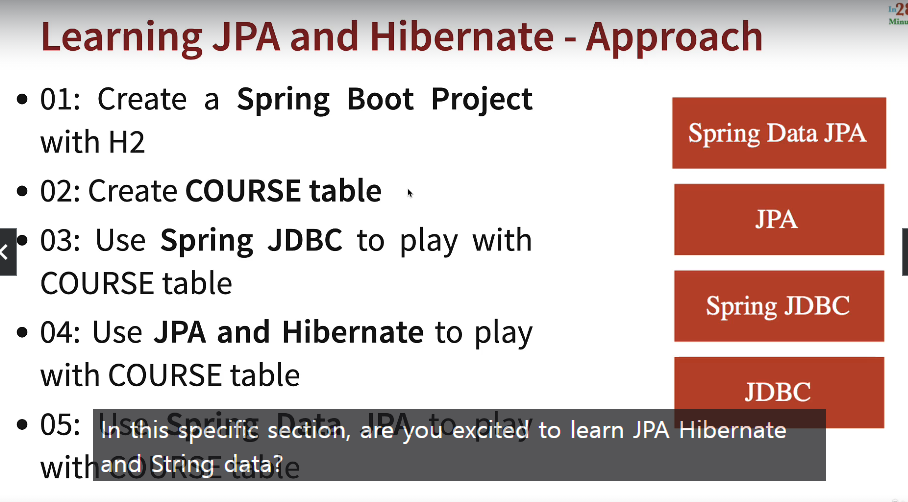

[before SpringBoot 3]
<ul>
    <li>
        Dependency Management
    </li>
    <li>
        configure Dispatcher servlet in web.xml
    </li>
    <li>
        should declare beans in context.xml
    </li>
</ul>

[sec05 - 52.spring initializr]
#### Spring Web만 dependency 추가해 Maven Project 생성

[sec05 - 57.spring devtools]
#### *** hot reload 지원함

[maven으로 jar 빌드하기]
#### 1. ./mvnw clean install

[jar 안에 내장톰캣이 함께 들어가 있음]
#### java -jar [어플리케이션명].jar 하면 바로 서버가 load됨

[Spring boot Actuator]
#### Monitor Applications

[JPA, hibernate]

[JDBC, Spring JDBC, JPA의 차이 실습]
